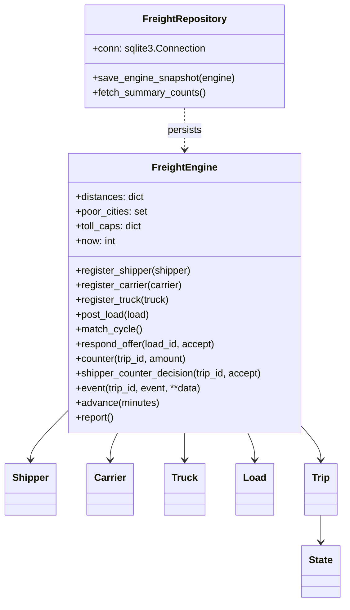

# Class & Service Architecture Diagram (T069-PS-099)

```mermaid
classDiagram
    class FreightEngine {
        +distances: dict
        +poor_cities: set
        +toll_caps: dict
        +now: int
        +register_shipper(shipper)
        +register_carrier(carrier)
        +register_truck(truck)
        +post_load(load)
        +match_cycle()
        +respond_offer(load_id, accept)
        +counter(trip_id, amount)
        +shipper_counter_decision(trip_id, accept)
        +event(trip_id, event, **data)
        +advance(minutes)
        +report()
    }

    class FreightRepository {
        +conn: sqlite3.Connection
        +save_engine_snapshot(engine)
        +fetch_summary_counts()
    }

    class Shipper
    class Carrier
    class Truck
    class Load
    class Trip
    class State

    FreightEngine --> Shipper
    FreightEngine --> Carrier
    FreightEngine --> Truck
    FreightEngine --> Load
    FreightEngine --> Trip
    Trip --> State
    FreightRepository ..> FreightEngine : persists
```
