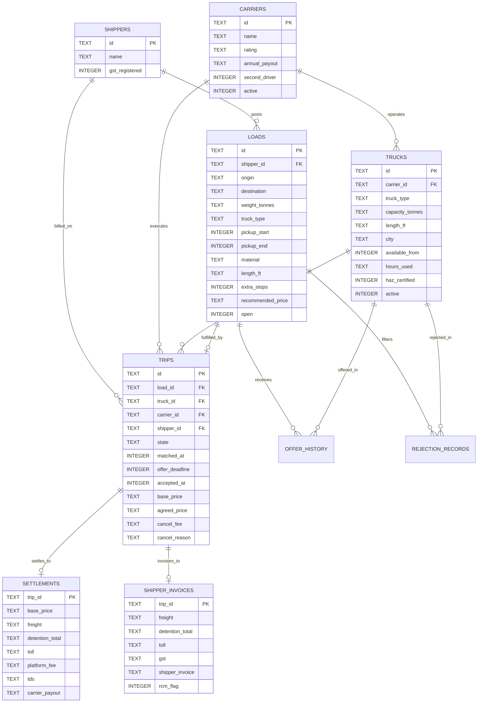

# Entity-Relationship Diagram (T069-PS-099)

```mermaid
erDiagram
    SHIPPERS ||--o{ LOADS : posts
    SHIPPERS ||--o{ TRIPS : billed_on
    CARRIERS ||--o{ TRUCKS : operates
    CARRIERS ||--o{ TRIPS : executes
    TRUCKS ||--o{ TRIPS : assigned_to
    LOADS ||--o| TRIPS : fulfilled_by
    TRIPS ||--o| SETTLEMENTS : settles_to
    TRIPS ||--o| SHIPPER_INVOICES : invoices_to
    LOADS ||--o{ OFFER_HISTORY : receives
    TRUCKS ||--o{ OFFER_HISTORY : offered_in
    LOADS ||--o{ REJECTION_RECORDS : filters
    TRUCKS ||--o{ REJECTION_RECORDS : rejected_in

    SHIPPERS {
        TEXT id PK
        TEXT name
        INTEGER gst_registered
    }
    CARRIERS {
        TEXT id PK
        TEXT name
        TEXT rating
        TEXT annual_payout
        INTEGER second_driver
        INTEGER active
    }
    TRUCKS {
        TEXT id PK
        TEXT carrier_id FK
        TEXT truck_type
        TEXT capacity_tonnes
        TEXT length_ft
        TEXT city
        INTEGER available_from
        TEXT hours_used
        INTEGER haz_certified
        INTEGER active
    }
    LOADS {
        TEXT id PK
        TEXT shipper_id FK
        TEXT origin
        TEXT destination
        TEXT weight_tonnes
        TEXT truck_type
        INTEGER pickup_start
        INTEGER pickup_end
        TEXT material
        TEXT length_ft
        INTEGER extra_stops
        TEXT recommended_price
        INTEGER open
    }
    TRIPS {
        TEXT id PK
        TEXT load_id FK
        TEXT truck_id FK
        TEXT carrier_id FK
        TEXT shipper_id FK
        TEXT state
        INTEGER matched_at
        INTEGER offer_deadline
        INTEGER accepted_at
        TEXT base_price
        TEXT agreed_price
        TEXT cancel_fee
        TEXT cancel_reason
    }
    SETTLEMENTS {
        TEXT trip_id PK
        TEXT base_price
        TEXT freight
        TEXT detention_total
        TEXT toll
        TEXT platform_fee
        TEXT tds
        TEXT carrier_payout
    }
    SHIPPER_INVOICES {
        TEXT trip_id PK
        TEXT freight
        TEXT detention_total
        TEXT toll
        TEXT gst
        TEXT shipper_invoice
        INTEGER rcm_flag
    }
```
