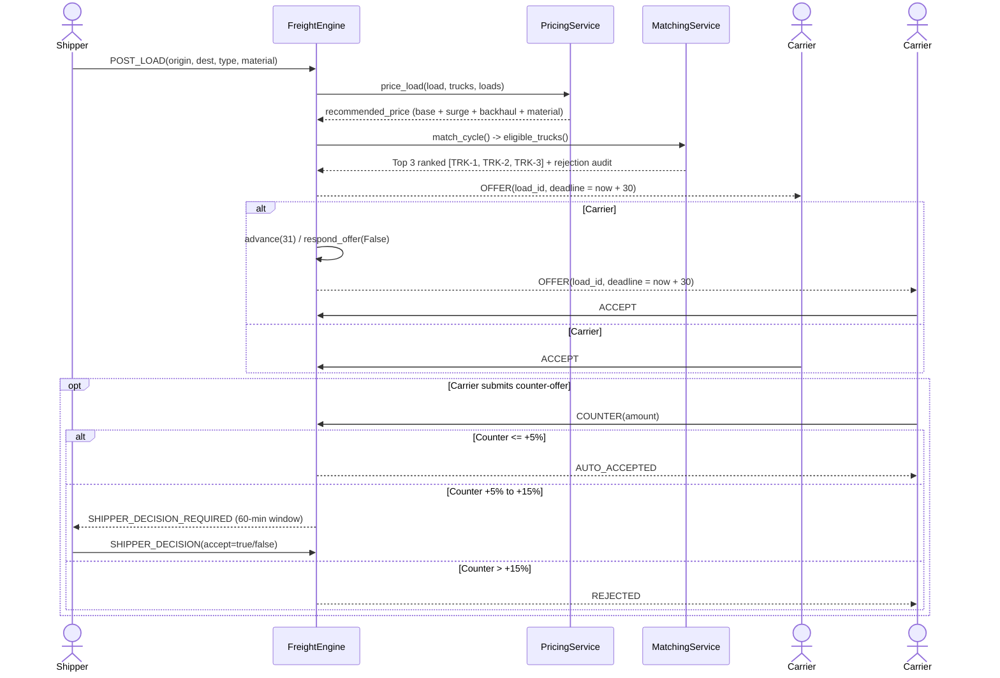

# Matching, Offer Timeout & Counter-Bidding Sequence Diagram

```mermaid
sequenceDiagram
    actor Shipper
    participant Engine as FreightEngine
    participant Pricing as PricingService
    participant Matcher as MatchingService
    actor Carrier1 as Carrier #1
    actor Carrier2 as Carrier #2

    Shipper->>Engine: POST_LOAD(origin, dest, type, material)
    Engine->>Pricing: price_load(load, trucks, loads)
    Pricing-->>Engine: recommended_price (base + surge + backhaul + material)

    Engine->>Matcher: match_cycle() -> eligible_trucks()
    Matcher-->>Engine: Top 3 ranked [TRK-1, TRK-2, TRK-3] + rejection audit
    Engine-->>Carrier1: OFFER(load_id, deadline = now + 30)

    alt Carrier #1 times out (>30 min) or declines
        Engine->>Engine: advance(31) / respond_offer(False)
        Engine-->>Carrier2: OFFER(load_id, deadline = now + 30)
        Carrier2->>Engine: ACCEPT
    else Carrier #1 accepts
        Carrier1->>Engine: ACCEPT
    end

    opt Carrier submits counter-offer
        Carrier2->>Engine: COUNTER(amount)
        alt Counter <= +5%
            Engine-->>Carrier2: AUTO_ACCEPTED
        else Counter +5% to +15%
            Engine-->>Shipper: SHIPPER_DECISION_REQUIRED (60-min window)
            Shipper->>Engine: SHIPPER_DECISION(accept=true/false)
        else Counter > +15%
            Engine-->>Carrier2: REJECTED
        end
    end
```
