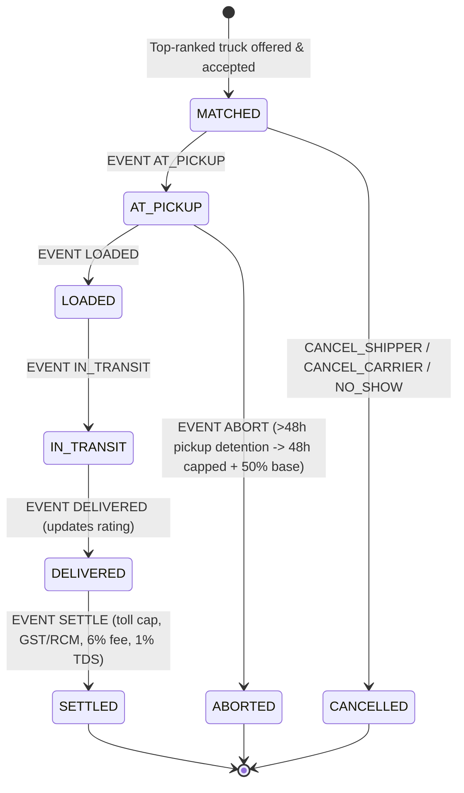

# Trip Lifecycle State Diagram (T069-PS-099)

```mermaid
stateDiagram-v2
    [*] --> MATCHED : Top-ranked truck offered & accepted
    MATCHED --> AT_PICKUP : EVENT AT_PICKUP
    AT_PICKUP --> LOADED : EVENT LOADED
    LOADED --> IN_TRANSIT : EVENT IN_TRANSIT
    IN_TRANSIT --> DELIVERED : EVENT DELIVERED (updates rating)
    DELIVERED --> SETTLED : EVENT SETTLE (toll cap, GST/RCM, 6% fee, 1% TDS)

    MATCHED --> CANCELLED : CANCEL_SHIPPER / CANCEL_CARRIER / NO_SHOW
    AT_PICKUP --> ABORTED : EVENT ABORT (>48h pickup detention -> 48h capped + 50% base)

    SETTLED --> [*]
    CANCELLED --> [*]
    ABORTED --> [*]
```
